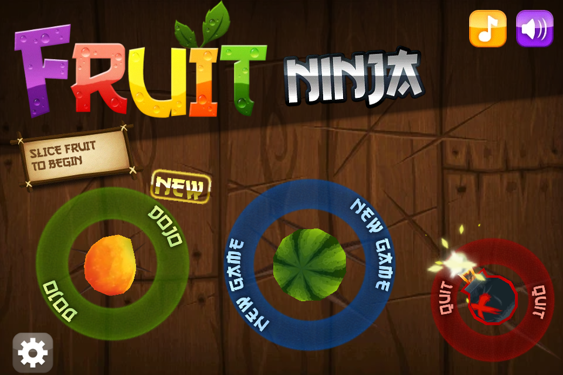
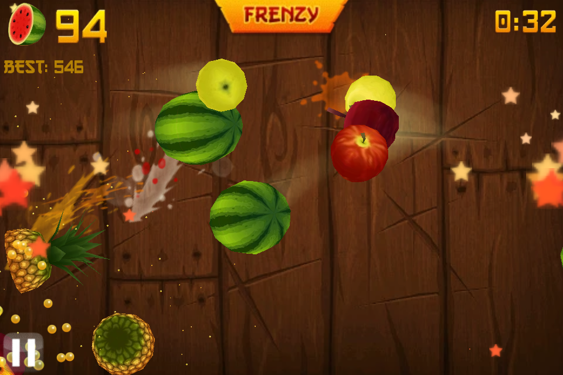
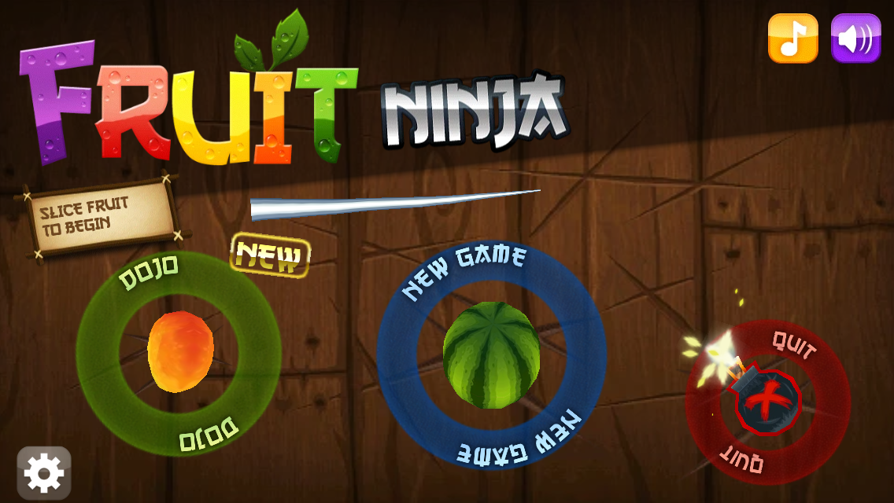

# Fruit Ninja — Reverse-Engineered Port

A from-scratch reimplementation of **Fruit Ninja v1.6.1** in portable C++11. The
original is the Samsung Bada release, built on Halfbrick's *Mortar* engine. This
port runs on modern desktops, the web, the Nintendo Wii, and LG webOS TVs.

The goal is **fidelity**. The port matches the original gameplay, physics,
scoring, timing, and visual behavior as closely as possible. Every behavior comes
from reverse-engineering the original ARM binary. The RE record lives in the
source itself, as `// ASM-verified:`, `// TODO:`, and `// DIFFERS:` comments next
to the code they describe. Separate design docs do not hold it.

> [!IMPORTANT]
> **Unofficial fan project, for preservation and education.**
> This project has no affiliation with Halfbrick Studios. Halfbrick does not
> authorize or endorse it. *Fruit Ninja*, its artwork, audio, models, name, and
> logo are © Halfbrick Studios and remain their property. **This repository
> includes no game assets.** You must supply your own copy of the original game
> data to build and run. The build reads that data from a local dump. The source
> tree holds only original reverse-engineered code and tooling.
>
> Built packages are a different matter. The webOS `.ipk`, the Wii zip, and the
> web deploy all bundle the game data, because the game cannot run without it.
> Do not redistribute them.

## Screenshots

The port running on the desktop host build.

| Main menu | Arcade mode |
|---|---|
|  |  |

The port also has a widescreen mode (16:9):

## Platforms

| Target | Backend | Package | Build entry |
|--------|---------|---------|-------------|
| Desktop (Windows/Linux) | SDL2 + desktop OpenGL (ES2 shader path) | executable | CMake presets (`cmake --preset host`) |
| Web | Emscripten / WebAssembly + WebGL (ES2) | static site | `tools/web/` |
| Nintendo Wii | devkitPPC / libogc / **GX** (no SDL) | Homebrew `.zip` | `tools/wii/build.sh` |
| LG webOS TV | SDL2 + GLES2 (openlgtv buildroot NDK) | `.ipk` | `tools/webos/build.sh` |

The renderer is a hand-written **OpenGL ES 2.0** shader pipeline. It draws 2D
quads, 3D meshes, fonts, and particles. The port replaced the original
fixed-function ES1 path completely. The Wii target uses native GX instead.

## Building

Every target uses CMake. Every target also needs the original game data present
locally, because this repository ships no assets. Each backend directory README
has the details.

- **Desktop:** configure with the committed CMake presets (`CMakePresets.json`).
  vcpkg supplies SDL2, SDL2_image, FreeType, and tinyxml2.
- **Web:** `tools/web/` uses the native Emscripten SDK. See `tools/web/README.md`.
- **Wii:** `tools/wii/build.sh` uses devkitPPC and libogc. It produces
  `fruit-ninja-wii.zip`.
- **webOS:** `tools/webos/build.sh` uses the openlgtv buildroot NDK on Linux or
  WSL. It produces an `.ipk`, checked with `webosbrew-ipk-verify`.

GitHub Actions also builds the webOS `.ipk` and the Wii homebrew zip, and uploads
each one as a workflow artifact. See `.github/workflows/`.

## Asset gallery

The web deploy publishes a browsable **asset gallery** at `/gallery`. It shows
the game textures and the extracted 3D models. The gallery streams each texture
at runtime as a byte-range slice of the game's WebAssembly `.data` bundle, so it
duplicates nothing. `tools/web/build-gallery.sh` generates the gallery from the
local game dump at build time. It commits no art, like the rest of the build.

## Documentation

- `docs/HANDOVER.md` — contributor onboarding (start here).
- `docs/port-plan.md` — the port's intent and scope.
- `docs/engine/` — the load-bearing reference set: file formats, static-init
  order, coordinate convention, the intentionally-skipped online-services list,
  and toolchain/ABI provenance.
- Each directory has a `README.md` that documents its own tool or pipeline.

## Reverse-engineering and toolchain

The original is an ARM32 little-endian Bada ELF. Halfbrick built it on the Mortar
engine with Sourcery G++ 4.4.1. An asm-verification pipeline
(`tools/asm-verify/`) cross-compiles the port with that original toolchain and
diffs the result against the binary. This keeps the reimplementation faithful.
`tools/ghidra/` holds the Ghidra scripts used during RE.

## License

The [MIT License](LICENSE) covers the reverse-engineered source code and tooling
in this repository. © 2026 Mariotaku.

Halfbrick Studios owns the original *Fruit Ninja* game content, assets, and
trademarks. The MIT License does not cover them. This repository does not include
or distribute them. See [NOTICE](NOTICE).

## Credits

Mariotaku did the reverse-engineering and the port. *Fruit Ninja* is a trademark
of Halfbrick Studios.
