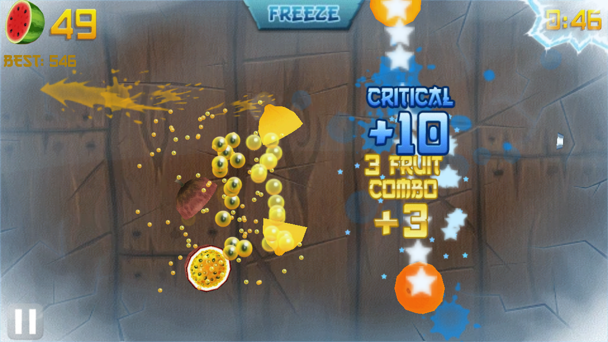

# Fruit Ninja — Reverse-Engineered Port

Fruit Ninja v1.6.1 for Samsung Bada, reverse-engineered from the ARM binary and
rewritten from scratch in C++11. The goal is to match the original exactly —
same physics, same spawn patterns, same scoring, same timing — not to remake it
or improve it. Where the port deliberately differs, the source says so.

Bada died and took the game with it. This runs it on hardware you actually own.

Unofficial fan project, not affiliated with Halfbrick. You need your own copy of
the game data to build or run it — none of it is in this repo.

## Screenshots

| Main menu | Arcade mode |
|---|---|
|  |  |

Widescreen (16:9):

## What's new

Most of the port is deliberately identical to the original. These are the parts
that aren't:

- **Widescreen (16:9).** The original is a fixed 3:2 480x320. Turn it on in
  Settings and restart — every hardcoded half-width in the layout goes through
  `Layout::HalfWidth()` so the field, camera and HUD all re-anchor.
- **Motion mode.** Point to aim, flick to cut, instead of dragging a finger.
  On by default. This is what makes an LG Magic Remote work.
- **Native refresh rate.** The simulation still runs the original's fixed 60 Hz
  tick — that part is not negotiable, it's what keeps the physics identical —
  but frames interpolate on top, so a 120 Hz screen gets 120 fps.
- **A settings screen.** v1.6.1 has no options UI whatsoever. This one has
  language, motion mode and sensitivity, FPS counter, frame-rate and widescreen
  toggles, and it actually saves them.
- **webOS TV and Wii.** Plus desktop and the browser.

Smaller things: mouse-wheel scrolling, ESC/Back as a back key, F12 screenshots,
optional HD textures, and a PWA build for the web that works offline.

## How to build

Everything is CMake, and every target needs the original game data present
locally.

| Target | Backend | Output | Build with |
|---|---|---|---|
| Desktop (Windows/Linux) | SDL2 + GL, ES2 shader path | executable | `cmake --preset host` |
| Web | Emscripten + WebGL | static site | `tools/web/build.sh` |
| LG webOS TV | SDL2 + GLES2 | `.ipk` | `tools/webos/build.sh` |
| Nintendo Wii | devkitPPC + libogc, native GX | homebrew `.zip` | `tools/wii/build.sh` |

Each of those has its own README with the details. The renderer is a
hand-written GLES2 shader pipeline — the original's fixed-function ES1 path is
gone — except on Wii, which draws through GX behind a GL shim.

CI builds the webOS `.ipk` and the Wii zip on every push, and attaches both to a
GitHub release when one is published.

Wii is playable but still rough around the edges; see `src/platform/wii/README.md`.

## How to develop

Start with `docs/HANDOVER.md`.

The RE record lives in the source, not in design docs. Every function carries
what is known about it as a comment — `// ASM-verified:` for anything checked
instruction-by-instruction against the binary, `// TODO: v1.6.1 0x...` for a gap
with the address to go read, `// DIFFERS:` for a deliberate deviation and why,
`// Defunct:` for the dead online services that are stubbed but kept in the call
graph. Grep for them.

`tools/asm-verify/` is the thing that keeps this honest: it cross-compiles the
port with the binary's own toolchain (GCC 4.4.1) and diffs the ARM output
against `FruitNinja.exe`, function by function, then ranks what actually looks
like a bug. `bash tools/asm-verify/run.sh` — see `tools/asm-verify/README.md`.

Tests are `ctest`; headless GL setup is in `tests/README.md`. Anything new with
few dependencies and many dependents gets a unit test.

`tools/README.md` indexes the rest — asset conversion, the web pipeline, the
Ghidra scripts.

## License

MIT for the code and tooling here. Fruit Ninja itself belongs to Halfbrick — see
[NOTICE](NOTICE).
